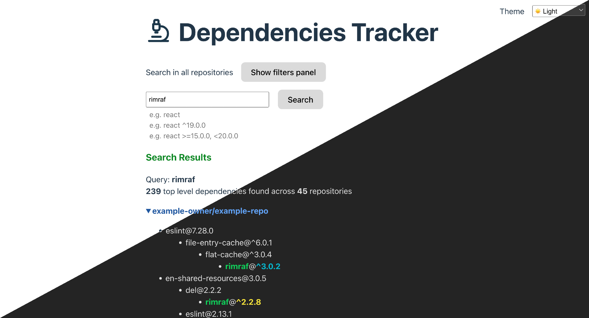

# Dependencies Tracker

Single page app to search for dependencies across yarn.lock files.



The yarn.lock files must be collected in a single tar.gz, which must then be available at some url.
The yarn.lock files in the tar.gz must be in paths mimicking the repository where they reside.

```bash
# content of lockfiles.tar.gz
owner/repo/yarn.lock
owner/other-repo/yarn.lock
other-owner/some-repo/yarn.lock
```

## How to run

```bash
yarn install # yarn >= 3.0
DEP_URL=url_to_yarnlockfiles.tar.gz yarn dev
```

## How to build as a static website

Same as "run", but the output will end in the `dist` directory

```bash
yarn install # yarn >= 3.0
DEP_URL=url_to_yarnlockfiles.tar.gz yarn build
```

## How to create lockfiles.tar.gz

Create a directory containing your lock files, e.g.

```
lockfiles/some_org/some_owner/yarn.lock
lockfiles/some_org/another_owner/yarn.lock
```

then create a tar.gz file out of them

```bash
cd lockfiles
tar -zcf ../lockfiles.tar.gz *
cd ..
```

and we're done. Put it somewhere online and use its url as DEP_URL env variable when you build.

## LICENSE

MIT
